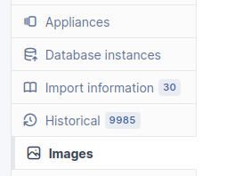
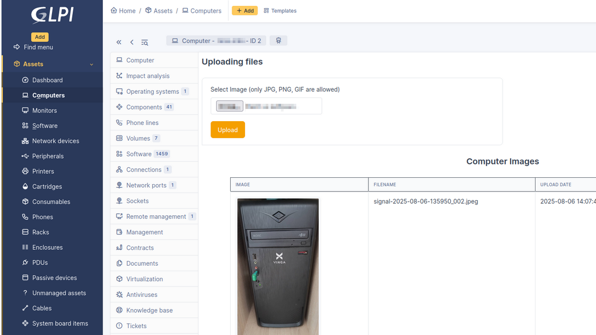

# Computer Images

This plugin extends GLPI functionality by adding a dedicated tab to Computer assets, enabling users to upload, view, and manage images associated with each computer. This enhances visual identification
 and inventory management.

Plugin features:

1. Adding an image with a link to a specific computer.
   
2. Viewing uploaded images in the form of a gallery.
   
3. Granting individual access rights to users to view, download and delete files.
   
4. Automatic creation of archive of table glpi_plugin_computerimages_images and media files

## Screenshots

### Image gallery tab

### Image management view

